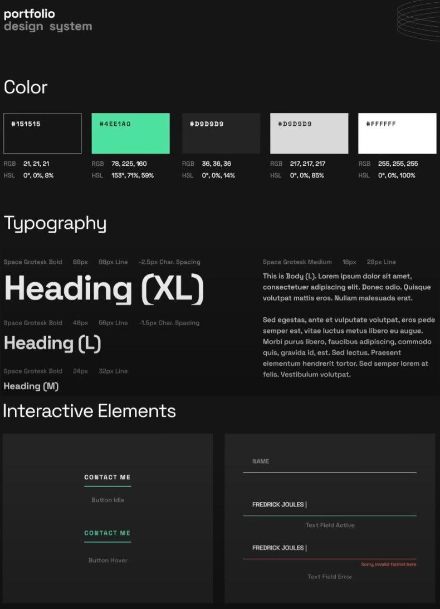

# [Frontend Mentor - Developer Portfolio]()

This is a solution to the [Single-page developer portfolio](https://www.frontendmentor.io/challenges/singlepage-developer-portfolio-bBVj2ZPi-x).

## Description

This project presents the construction of a landing page built from scratch using HTML CSS and JS, the site is fully responsive and contains animations that improve the user experience. Your users should be able to:

- View the optimal layout for the site depending on their device's screen size
- See hover states for all interactive elements on the page

## Installation

The project has been created using a extension of visual studio code: [Live Server](https://marketplace.visualstudio.com/items?itemName=ritwickdey.LiveServer "Live Server") to visualize the changes made in the browser (hot reload).

### Links

- Solution URL: [Single-page developer portfolio]()

## My process

### Built with

- Semantic HTML5 markup
- CSS custom properties
- Flexbox
- CSS Grid
- Mobile-first workflow
- Js

## What I learned

- Using a helper CSS class with transform to build animation
- Using helper classes to set top/bottom and left/right spacing for sections
- Responsive design vs intrinsic design approaches
- Using srcset and sizes in img html tag
- Create a hero section with a design
- Uses clamp in css to increase or decrease font size with responsive
- Positioned images

## Stay in touch

- Website - [www.bryan-aguilar.com](https://www.bryan-aguilar.com/)
- Medium - [baguilar6174](https://baguilar6174.medium.com/)
- LinkeIn - [baguilar6174](https://www.linkedin.com/in/baguilar6174)

## Contributing

Pull requests are welcome. For major changes, please open an issue first to discuss what you would like to change.

## Single-page developer portfolio

<table>
  <tr>
    <td>System Design</td>
  </tr>
  <tr>
    <td align="center" valign="center"></td>
  </tr>
</table>
